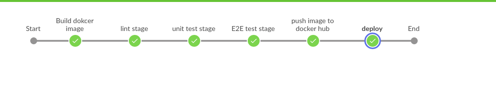
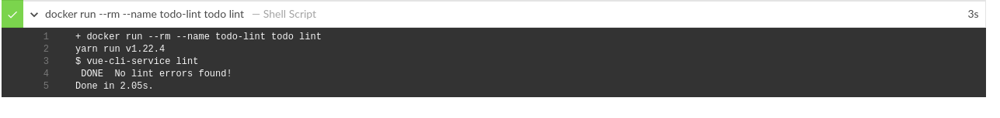
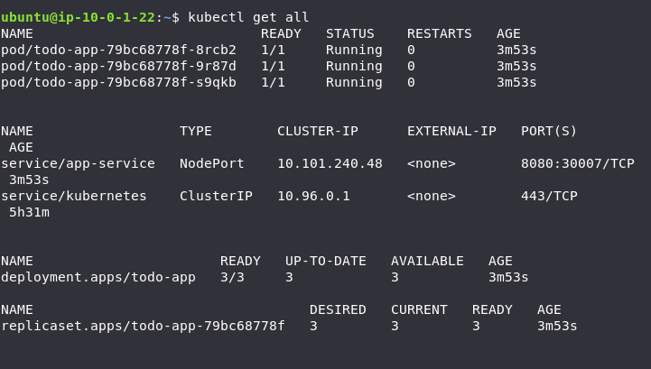
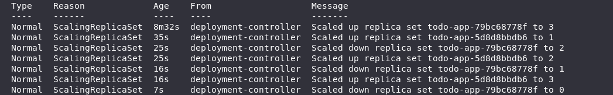

# Udacity cloud DevOps Capstone project

in this project i applied some skills and knowledge 

- cloud formation to deploy k8s cluster
- ansible to configure master and worker nodes
- jenkins to implement Continuous Integration and Continuous Deployment
- docker as as container technology
- kubernetes as orchestration technology

## create k8s cluster and configure it
* create k8s infra
  ```
    cd k8s-infra/
    ./create.sh kubeStack kubernetes_infra.yml infraParams.json
  ```
* configure k8s
  ```
    cd ../configure-k8s-cluster/
  ```
   copy master and worker ips from output and replace them in Inventory with key path
  ```
    ansible-playbook -i Inventory playbook.yml
  ```

## CI/CD pipeline


## lint stage


## all pods are running 


## rolling update 


The process started by increasing the number of replicas of the new ReplicaSet (`todo-app-5d8d8bbdb6`) to 1. Next, it decreased the number of replicas of the old ReplicaSet (`todo-app-79bc68778f`) to 2. The same process of increasing replicas of the new, and decreasing replicas of the old ReplicaSet continued until the new one got the desired number (3), and the old one dropped to zero.
